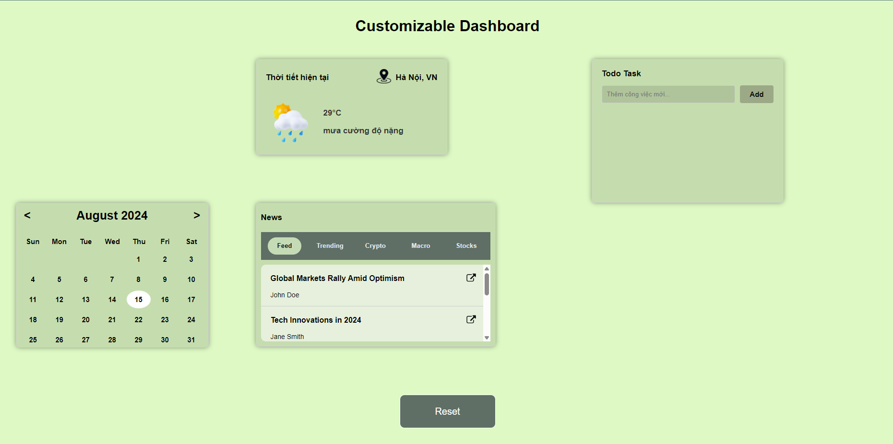

# **Hướng dẫn chạy thử ứng dụng**

## **Chạy bằng Browser**

- Windows:

  - Nhấp đúp vào file HTML. Trình duyệt mặc định của hệ thống sẽ tự động mở file này.

- MacOS:

  - Tương tự như Windows, nhấp đúp vào file HTML.

  - Hoặc, bạn có thể kéo thả file HTML vào cửa sổ trình duyệt.

- Linux:

  - Mở terminal, điều hướng đến thư mục chứa file HTML.

  - Sử dụng lệnh xdg-open tên_file.html để mở file.

## **Chạy bằng VSCode**

- Cài đặt extension Live Server trong VSCode.

- Nhấp chuột phải vào file HTML và chọn "Open with Live Server".

- Live Server sẽ tự động mở một tab mới trong trình duyệt và tự động cập nhật khi bạn thay đổi code.

# **Hình ảnh giao diện ứng dụng**

### **_Application Screen_**

### **_Droped Widget Screen_**

