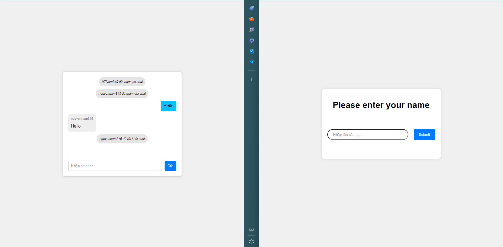

# **Hướng dẫn chạy thử ứng dụng**

## **Bước 1: Clone repository về máy**

- Trước tiên, bạn cần clone repository từ GitHub hoặc một nguồn khác về máy của mình. Mở terminal và sử dụng lệnh git clone:

  ```javascript
  git clone <repository-url>
  ```

- Thay <repository-url> bằng URL của repository mà bạn muốn clone.

## **Bước 2: Di chuyển vào thư mục dự án**

- Sau khi clone xong, di chuyển vào thư mục dự án:

  ```javascript
  cd <project-directory>
  ```

- Thay <project-directory> bằng tên thư mục của dự án vừa clone.

## **Bước 3: Cài đặt các dependencies**

- Sử dụng npm để cài đặt các dependencies được liệt kê trong file package.json:

  ```javascript
  npm install
  ```

## **Bước 4: Chạy ứng dụng**

- Sau khi cài đặt xong các dependencies và cấu hình môi trường, bạn có thể chạy ứng dụng bằng lệnh:

  ```javascript
  node app.js
  ```

## **Bước 5: Truy cập ứng dụng**

- Mở trình duyệt và truy cập vào địa chỉ http://localhost:3000

# **Hình ảnh giao diện ứng dụng**

### **_Application Screen_**


### **_Join A Chat Group_**


### **_Show Messages_**


## **_Leave The Group_**


